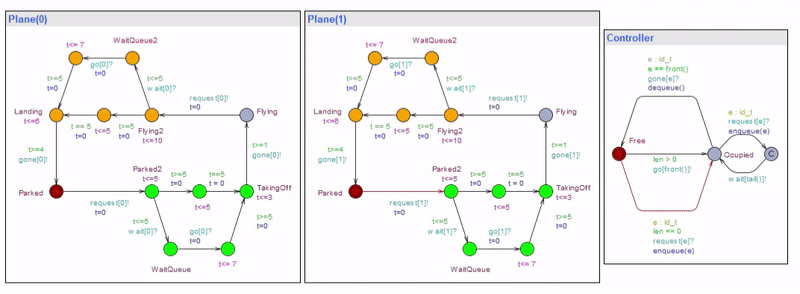

# Ciber Physics Computing Class 2022/23

This repository contains some of the work done for the Physics Computing Classas a student. The material is organized in the following folders:

- `airport_uppal`: An airport with one lane and $n$ planes controlled by a single controller modeled and verified in Uppaal.
- `probabilistic_haskell`: An programming language written in Haskell that allows to model probabilistic systems.
- `individual-homeworks`: Individual homeworks done during the course.

Note that the [Final Report](final_report.pdf) file contains final project report, which is a summary of the work done during the course.

## Course Information

[Link to Course](https://lmf.di.uminho.pt/CyPhyComp2223/)

